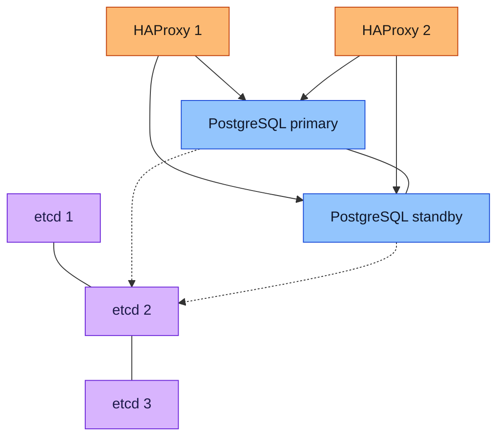
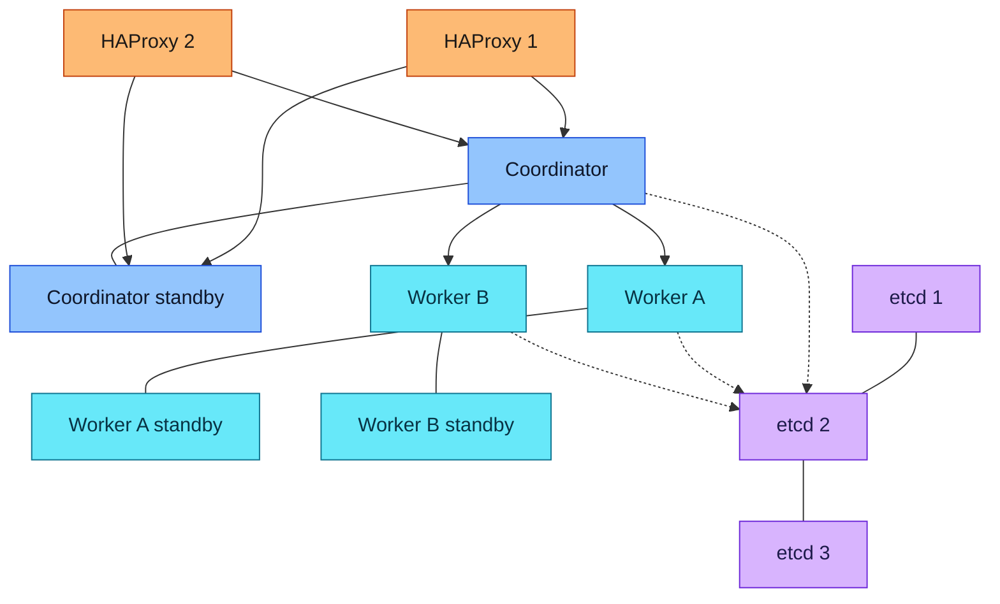
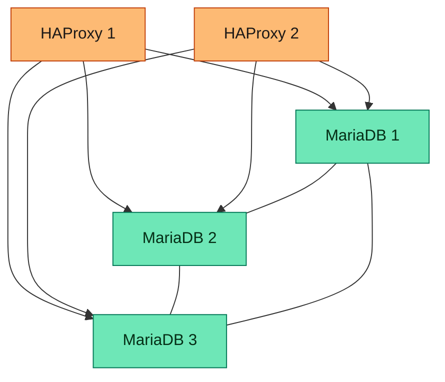
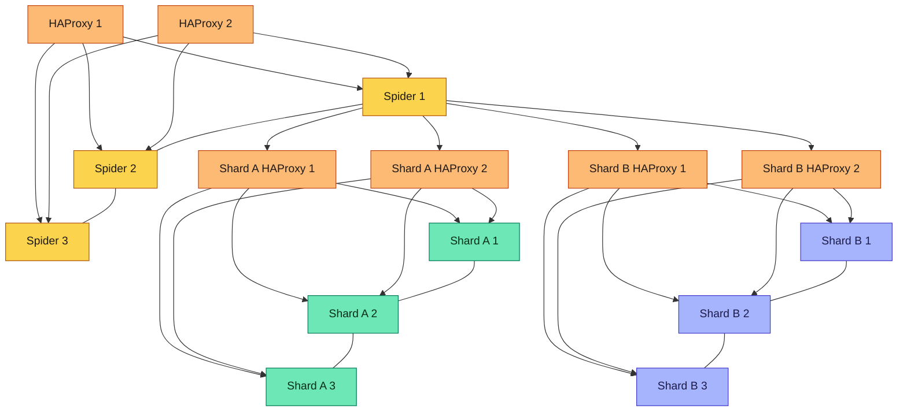
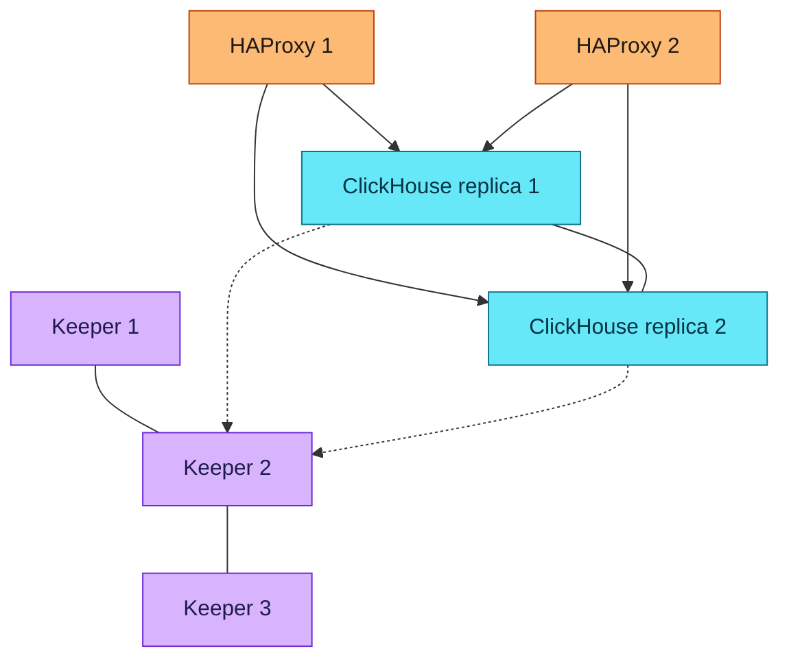
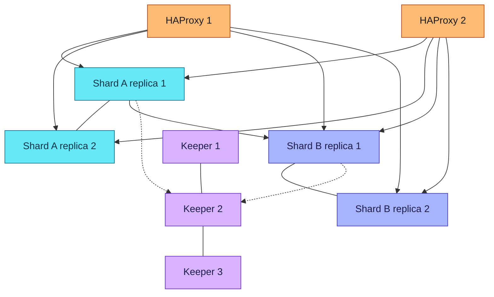
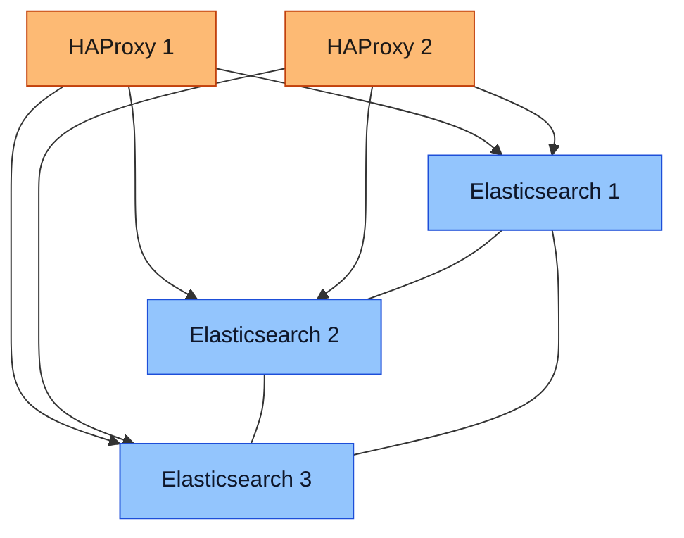

# am-databases

Domain status: decision only (no playbook files yet)

## Purpose

Database services for the stack. Each engine is its own playbook. The playbooks are separate and can be used together.

Each playbook can run as one guest, as a replicated set, or as a sharded set. A project can use replication and sharding together. The project picks the layout in local settings. The minimum guest count for each layout is decided one playbook at a time.

Debian 12, Debian 13, Ubuntu 24.04, or Ubuntu 26.04. The playbook pins the database version. The repository URL stays in local settings. That pin is the same on each of those releases. Each guest has an extra disk for its data directory. vCPU, RAM, and disk size stay in local settings.

When the project needs TLS, the engine terminates it. The administrator provides the certificate and the key. They stay in local settings. Accounts and passwords stay in local settings.

## Playbook

- `postgresql/`
  - PostgreSQL as a systemd service. Patroni runs on the PostgreSQL guests and promotes a standby when the primary fails
  - Citus is the sharding extension, AGPL-3.0, on those same guests. One coordinator and workers. Applications connect to the coordinator. Many shards share a worker
  - For applications that want a shared database. Mattermost, Stalwart, Metabase, Superset, Keycloak, GitLab, and Zabbix keep their own data and do not use this playbook
  - Three etcd layouts. The project picks one in local settings. etcd on the PostgreSQL guests is installed by this playbook beside PostgreSQL and Patroni, and that guest count must be odd. External etcd is guests the administrator provides, not the PostgreSQL guests, and this playbook installs etcd there. An existing etcd cluster is addresses in local settings, and this playbook does not install it. An etcd count is at least 3 and odd. This playbook does not create the guests
  - One guest is a local-settings choice. That choice runs PostgreSQL only. Patroni and etcd stay off
  - This playbook does not install or configure a proxy. A project that wants one uses `al-traffic-management`
  - Guest counts for every supported scenario:

| Scenario | PostgreSQL VMs | etcd VMs | Total you provide |
| --- | --- | --- | --- |
| One guest, selected in local settings | 1 | 0. Patroni and etcd stay off | 1 |
| Replicated. etcd on the PostgreSQL guests | 3, odd | 0 extra | 3 |
| Replicated. External etcd | 2 | 3, odd | 5 |
| Replicated. Existing etcd cluster | 2 | 0. The cluster already has at least 3 members | 2 |
| Citus, no standbys. etcd on those guests | 3. One coordinator and two workers | 0 extra | 3 |
| Citus, no standbys. External etcd | 3 | 3 | 6 |
| Citus, no standbys. Existing etcd cluster | 3 | 0 | 3 |
| Citus, every primary has a standby. etcd on those guests | 7. Six is even, so one extra standby | 0 extra | 7 |
| Citus, every primary has a standby. External etcd | 6. Coordinator pair plus two worker pairs | 3 | 9 |
| Citus, every primary has a standby. Existing etcd cluster | 6 | 0 | 6 |

The counts are minimums. Another worker is one guest, or two when that worker has a standby. etcd can be 3, then 5, then 7. The number of shards does not add a guest. A Citus row with no standbys keeps a worker's shards only on that disk. A row with standbys keeps those shards on the standby.

A project that wants one address adds two HAProxy guests from `al-traffic-management`. The one-guest layout does not. The diagrams show that pair. The table does not count those guests.

HAProxy is not placed in front of etcd. Applications do not connect to etcd. Patroni on each PostgreSQL guest is given the etcd address list and uses that list to reach a live member. etcd holds the leader lock. The two HAProxy guests sit in front of the guests that accept client sessions. Each one has the same backend list and checks Patroni's health endpoint, so the session goes to the guest that is the current primary. In a Citus layout that guest is a coordinator. A client uses either HAProxy guest. This playbook does not add a virtual address in front of those two guests.

PostgreSQL cluster. External etcd, the minimum of 2 database guests and 3 etcd guests, plus the HAProxy pair. The dashed lines are the Patroni leader lock. etcd on the database guests, or an existing etcd cluster, replaces the three etcd guests.

PostgreSQL sharded cluster. HAProxy faces only the coordinators. Each worker's standby holds that worker's shards. The etcd guests are the external layout.

- `mariadb/`
  - MariaDB Community Server as a systemd service. The license is GPL-2.0
  - Galera is the cluster. It is part of MariaDB Server. Every data node holds the full database. A commit is certified by a majority before it returns. Patroni, etcd, and Citus are not used here
  - One guest is a local-settings choice. That choice runs MariaDB only. Galera stays off
  - Galera with only data nodes: Make requires at least 3, and that count must be odd. Two data nodes are refused. This playbook does not create the guests
  - Galera with an arbitrator: 2 data nodes plus one `garbd` guest. The arbitrator votes and sees the replication traffic. It does not store the tables. It is its own guest, so it does not die with a data node
  - This playbook does not install or configure a proxy. A project that wants one uses `al-traffic-management`
  - Three layouts. The project picks one in local settings. One guest. A Galera cluster. A sharded Galera cluster
  - Sharding uses Spider, on its own guests. A Spider node holds the virtual table and routes to the shards. It does not store the shard rows. One Spider node is refused. The Spider nodes are their own Galera set, so one of them can fail and the others still route
  - Each shard is its own Galera set and holds only its part of the rows. Make requires at least 2 shards. The same Galera rules apply: at least 3 data nodes and an odd count, or 2 data nodes plus one `garbd` guest
  - Guest counts:

| Scenario | Spider VMs | Data VMs | Arbitrators | Total you provide |
| --- | --- | --- | --- | --- |
| One guest, selected in local settings | 0 | 1 | 0. Galera stays off | 1 |
| Galera, data nodes only | 0 | 3, odd | 0 | 3 |
| Galera, two data nodes and an arbitrator | 0 | 2 | 1 | 3 |
| Sharded cluster, data nodes only | 3, odd | 6. Two shards, three data nodes each | 0 | 9 |
| Sharded cluster, two data nodes and an arbitrator | 2 | 4. Two shards, two data nodes each | 3. One for the Spider set and one for each shard | 9 |

The counts are minimums. A Galera data-node set can be 3, then 5, then 7. Another shard is 3 data nodes, or 2 data nodes plus one arbitrator. A failed Galera data node leaves that node's full copy on the surviving majority. In the sharded rows, that copy is the shard, not the whole database.

A project that wants one address adds two HAProxy guests from `al-traffic-management`. The one-guest layout does not. The table counts database guests only.

Each HAProxy guest checks that a data node is synced in the primary component, then sends the session to one such node. The other synced nodes stay ready. That keeps writes on one node. `garbd` is not a client address.

Spider stores the address of each shard, and its own failover between those addresses was removed in MariaDB 10.7.5. Each shard therefore has its own two HAProxy guests. Every Spider node is given both addresses for that shard. Spider connects to a live data node through that pair. The pair in front of the Spider nodes is separate. Two shards add six HAProxy guests: two in front of Spider, and two in front of each shard.

MariaDB Galera cluster. Three data nodes, each with the full database, plus the HAProxy pair. The two-data-node layout replaces MariaDB 3 with one `garbd` guest. `garbd` is not behind HAProxy.

MariaDB sharded cluster. The front pair faces the Spider nodes. Each shard has its own pair, and Spider uses that pair to reach a synced data node. Green is shard A. Indigo is shard B. Each shard holds only its own rows.
- `clickhouse/`
  - ClickHouse as a systemd service. The database code is Apache 2.0. ClickHouse Cloud and the paid self-managed addendum stay out
  - Three layouts. The project picks one in local settings. One guest. One shard with replicas. A sharded cluster
  - One guest is a local-settings choice. That choice runs ClickHouse only. Keeper stays off
  - Replication uses `ReplicatedMergeTree`. Each shard has its own replicas, and a replica holds that shard's rows. ClickHouse Keeper stores the replication log. It does not store the rows. ZooKeeper is not used
  - Three Keeper layouts. Keeper on the ClickHouse guests. External Keeper on guests the administrator provides, and this playbook installs it. An existing Keeper cluster, with the addresses in local settings, and this playbook does not install it. A Keeper count is at least 3 and odd. Two Keepers are refused. This playbook does not create the guests
  - A sharded cluster has at least 2 shards, and each shard has at least 2 replicas. Any ClickHouse guest can run the distributed query. There is no separate router tier, and there is no HAProxy pair per shard
  - This playbook does not install or configure a proxy. A project that wants one address adds two HAProxy guests from `al-traffic-management`. The pair faces the ClickHouse guests. It is not placed in front of Keeper. Each ClickHouse guest is given the Keeper address list
  - Guest counts:

| Scenario | ClickHouse VMs | Keeper VMs | Total you provide |
| --- | --- | --- | --- |
| One guest, selected in local settings | 1 | 0. Keeper stays off | 1 |
| One shard, Keeper on those guests | 3, odd. Three replicas | 0 extra | 3 |
| One shard, external Keeper | 2 | 3, odd | 5 |
| One shard, existing Keeper | 2 | 0. The cluster already has at least 3 members | 2 |
| Sharded, Keeper on the ClickHouse guests | 4. Two shards, two replicas. Keeper runs on 3 of them | 0 extra | 4 |
| Sharded, external Keeper | 4 | 3 | 7 |
| Sharded, existing Keeper | 4 | 0 | 4 |

The counts are minimums. Another shard is two ClickHouse guests. Keeper can be 3, then 5. A failed replica leaves that shard's rows on the other replica. The parts copy after the insert, so an insert that has not reached the other replica is still only on the disk that failed. Keeper losing quorum blocks new replicated writes. The rows stay on the ClickHouse disks.

The HAProxy pair is not in the table. HAProxy checks that a ClickHouse guest answers, then sends the session there. On a sharded cluster that guest runs the distributed query and writes each shard's part to one of its replicas.

ClickHouse cluster. One shard, two replicas, external Keeper, plus the HAProxy pair. The dashed lines are the Keeper address list. Keeper on the ClickHouse guests replaces this picture with three replicas and no separate Keeper guests.

ClickHouse sharded cluster. Cyan is shard A. Indigo is shard B. HAProxy can send the session to any replica, and that replica queries both shards. The arrow between the shards is that distributed query. Keeper is not behind HAProxy.
- `elasticsearch/`
  - Elasticsearch as a systemd service, for applications. This is not the Elasticsearch in `at-centralized-logging`. ELK and EFK keep their own clusters
  - The playbook builds a pinned 9.x source release and chooses AGPL-3.0. It does not install Elastic's package. Snapshots, alphas, betas, and release candidates stay out. The pin moves only to another maintained 9.x release. X-Pack stays out, including the built-in login, machine learning, and cross-cluster replication. The JDK used to compile does not stay on the guest
  - Three layouts. The project picks one in local settings. One guest. A cluster. A sharded cluster. Elasticsearch elects its own masters and stores its own shard copies. A master count of two is refused
  - One guest is a local-settings choice. That guest has no second copy
  - The cluster is 3 guests. Each guest can be master and hold data. One guest can fail, the other two still elect a master, and each shard has a replica on another guest
  - The sharded cluster is those same 3 guests. The index is split into primary shards, and each primary has a replica on another of those guests. That replica is the backup copy. It does not get its own virtual machine. One guest can fail and the replica on a remaining guest is promoted. A layout of 3 master-only guests plus at least 2 data guests is a later size change, when the data outgrows these 3
  - This playbook does not install or configure a proxy. A project that wants one address adds two HAProxy guests from `al-traffic-management`. The pair faces the Elasticsearch guests. A client uses either HAProxy guest
  - Guest counts:

| Scenario | Elasticsearch VMs | Total you provide |
| --- | --- | --- |
| One guest, selected in local settings | 1 | 1 |
| Cluster | 3. Each guest can be master and hold data | 3 |
| Sharded cluster | 3. The same guests. Each primary shard has its replica on another of these guests | 3 |

The HAProxy pair is not in the table.

Elasticsearch cluster. Three guests, and the sharded layout uses these same three. HAProxy sends the session to a live guest. That guest serves its own shards and fetches a replica from another guest when it must.
- `mongodb/`
  - MongoDB Community Server as a systemd service
  - Community Server is SSPL. That is not an OSI open-source license. It is in this domain because the stack asked for MongoDB
  - Layout minimums are still open

## Alternatives

- MySQL, for the relational engines. No second analytics engine was named for ClickHouse.
- OpenSearch, for Elasticsearch. ELK and EFK keep their own Elasticsearch and can be used together with this guest.

## Left out

- MySQL
- MariaDB Enterprise
- ClickHouse Cloud and the paid ClickHouse self-managed addendum
- ZooKeeper. ClickHouse Keeper is the coordination service
- The paid Azure database built on Citus

## Dependencies

- Upstream: the guests the administrator provides. This playbook does not create them and does not call provisioning or hardening
- Downstream: applications that choose this database in their own local settings

## Status

- Playbook files: no
- Review: `postgresql/`, `mariadb/`, `clickhouse/`, and `elasticsearch/` are decided. Next is `mongodb/`
