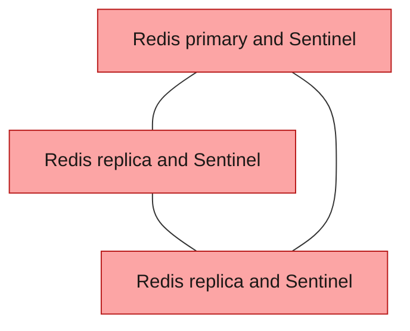
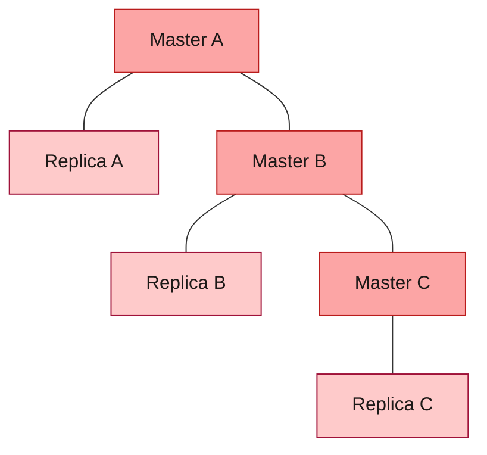

# an-data-caching

Domain status: decision only (no playbook files yet)

## Purpose

An in-memory cache for applications. The cache is Redis.

## Playbook

- `redis/`
  - Redis 8 as a systemd service. The playbook pins a maintained 8.x release and chooses AGPL-3.0. The same package also offers the Redis Source Available License and the SSPL. Redis 7.4 through 7.8 cannot be chosen under AGPL. Snapshots, alphas, betas, and release candidates stay out
  - Three layouts. The project picks one in local settings. One guest. Sentinel. Redis Cluster
  - One guest is a local-settings choice. That guest has no second copy
  - Sentinel is 3 guests. Each guest runs Redis and Sentinel. One primary and two replicas. Each replica holds the full cache. One guest can fail, and Sentinel elects a replica. Two Sentinels are refused. The next odd count is 5
  - Redis Cluster is 6 guests. Three masters, and each master has a replica. A master can fail, and its replica is promoted. Masters stay odd. The next count is 5 masters, each with a replica
  - The cache lives in memory. An extra disk holds the persistence file. vCPU, RAM, and disk size stay in local settings
  - A Redis client finds the current node itself. This playbook does not install or configure a proxy
  - This playbook does not create the guests and does not call provisioning or hardening
  - Guest counts:

| Scenario | Redis VMs | Total you provide |
| --- | --- | --- |
| One guest, selected in local settings | 1 | 1 |
| Sentinel | 3. One primary and two replicas. Sentinel runs on each guest | 3 |
| Redis Cluster | 6. Three masters, each with a replica | 6 |

Redis with Sentinel. Three guests. Each replica holds the full cache. Sentinel elects the next primary.

Redis Cluster. Each master holds its own part of the cache, and its replica holds that same part.

## Alternatives

- Valkey and Memcached. `redis/` is the cache playbook.

## Left out

- Valkey
- Memcached
- HAProxy in front of Redis. The client finds the node

## Dependencies

- Upstream: the guests the administrator provides. This playbook does not create them
- Downstream: applications that want a cache. `ao-message-brokers` leaves streams on this cache

## Status

- Playbook files: no
- Review: decided
