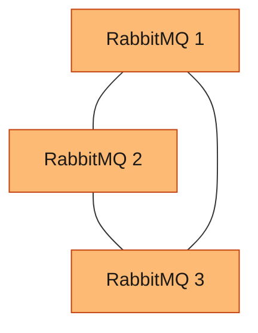
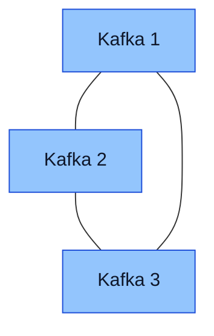

# ao-message-brokers

Domain status: decision only (no playbook files yet)

## Purpose

Message brokers that services actually publish to. Each broker is its own playbook. The playbooks are separate and can be used together.

## Playbook

- `rabbitmq/`
  - RabbitMQ 4 as a systemd service. The playbook pins a maintained 4.x release. Snapshots, alphas, betas, and release candidates stay out. The pin moves only to another maintained 4.x release
  - Classic queue mirroring is gone in this line. A replicated queue is a quorum queue. Three members is the practical minimum, so one guest can fail and a majority still has the message
  - Three layouts. The project picks one in local settings. One guest. A cluster of 3. Sharding does not add guests
  - One guest is a local-settings choice. That guest has no second copy
  - The cluster is 3 guests. Two guests are refused for a quorum queue. The next odd member count is 5
  - Adding a guest to an existing cluster is supported. The administrator provides the guest. This playbook joins it. A quorum queue keeps an odd member count, 3 or 5. The cluster can grow by one guest and those queues can stay on 3 members
  - This playbook does not create the guests and does not call provisioning or hardening
  - A client uses the broker addresses. This playbook does not install or configure a proxy
  - Guest counts:

| Scenario | RabbitMQ VMs | Total you provide |
| --- | --- | --- |
| One guest, selected in local settings | 1 | 1 |
| Cluster | 3. Quorum queues | 3 |
| Sharded | 3. The same guests | 3 |

RabbitMQ cluster. Three guests. A quorum queue keeps its copies on these guests.

- `kafka/`
  - Kafka 4 as a systemd service, in KRaft mode. ZooKeeper is not used. The playbook pins a maintained 4.x release. Snapshots, alphas, betas, and release candidates stay out. The pin moves only to another maintained 4.x release
  - Three layouts. The project picks one in local settings. One guest. A cluster of 3. Sharding does not add guests
  - One guest is a local-settings choice. That guest is both broker and controller. It has no second copy, and the controller has no standby
  - The cluster is 3 guests. Each guest is a broker and a KRaft controller. One guest can fail, the other two still have a controller majority, and each partition has a replica on another guest. Two controllers are refused. The next odd controller count is 5
  - Adding a broker to an existing cluster is supported. The administrator provides the guest. This playbook joins it as a broker. The new broker does not have to keep the total odd. The controllers stay at 3 unless the project grows them to 5. Existing partitions can be moved onto the new broker
  - This playbook does not create the guests and does not call provisioning or hardening
  - A client uses the broker addresses. This playbook does not install or configure a proxy
  - Guest counts:

| Scenario | Kafka VMs | Total you provide |
| --- | --- | --- |
| One guest, selected in local settings | 1. Broker and controller | 1 |
| Cluster | 3. Each guest is a broker and a controller | 3 |
| Sharded | 3. The same guests. Each partition has a replica on another guest | 3 |

Kafka cluster. Three guests. Each one holds partitions and votes as a controller. A partition's replica stays on another of these guests.

## Alternatives

- NATS. `rabbitmq/` and `kafka/` are separate playbooks and can be used together.

## Left out

- NATS
- ZooKeeper
- Streams on the cache. The cache stays in `an-data-caching/redis`
- HAProxy in front of either broker. The client uses the broker addresses

## Dependencies

- Upstream: the guests the administrator provides. This playbook does not create them
- Downstream: applications that publish or subscribe

## Status

- Playbook files: no
- Review: decided
