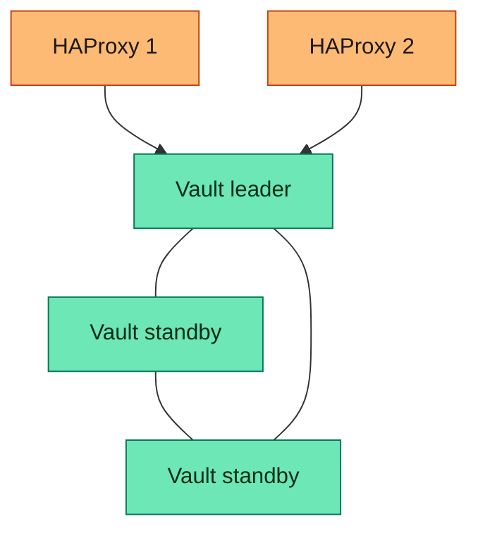

# ar-secrets-and-pki

Domain status: decision only (no playbook files yet)

## Purpose

A secrets store, and certificates for services that opt in. OpenVPN certificates stay on the perimeter pair. TLS certificates already kept in local settings stay there. A service uses Vault only when that service is pointed at it.

## Playbook

- `vault/`
  - HashiCorp Vault as a systemd service. The license is BSL 1.1, so this playbook does not meet the open-source rule. It stays from the earlier decision. OpenBao is the open-source match and is not this playbook
  - Two layouts. The project picks one in local settings. One guest. A Raft cluster
  - One guest is a local-settings choice. That guest has no second copy
  - The cluster is 3 guests. Every guest holds a full copy. Only the leader answers. A standby tells a direct client the leader's own address. One guest can fail, and the others elect a new leader. Two guests are refused. The next count is 5. Adding a guest keeps the count odd
  - The paid edition's standby reads stay out. A standby does not serve secrets
  - For the cluster, the administrator provides 2 HAProxy guests. `al-traffic-management/haproxy` installs HAProxy. This playbook connects to those guests and writes the configuration. The pair sends a request only to the current leader. A client uses either HAProxy guest. The one-guest layout has no HAProxy pair. The pair is not part of the Vault guest count
  - This playbook does not create the guests and does not call provisioning or hardening
  - How Vault is unlocked after a reboot is still open
  - Guest counts:

| Scenario | Vault VMs | HAProxy VMs | Total you provide |
| --- | --- | --- | --- |
| One guest, selected in local settings | 1 | 0 | 1 |
| Cluster | 3, then 5 | 2 | 5, then 7 |

Vault cluster. The pair sends traffic only to the leader. The standbys hold a full copy and can be elected.

## Alternatives

- OpenBao is the open-source match. step-ca was left out.

## Left out

- OpenBao
- OpenVPN certificates. Those stay on the `debian-based-perimeter` pair
- A separate step-ca playbook
- The paid Vault edition

## Dependencies

- Upstream: the guests the administrator provides. This playbook does not create them. For the cluster, the administrator also provides the HAProxy guests
- Downstream: services that are pointed at Vault

## Status

- Playbook files: no
- Review: the cluster and the HAProxy pair are decided. Unlocking after a reboot is still open
